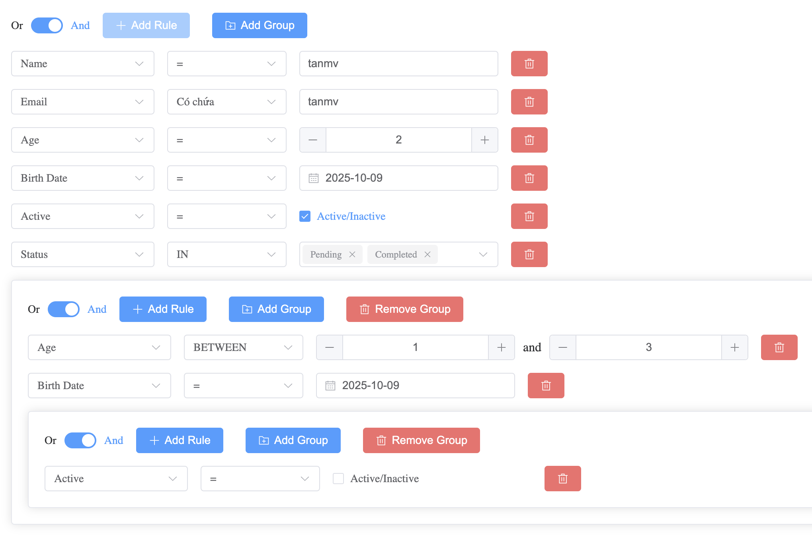

# Vue 3 QueryBuilder

A powerful and flexible query builder component for Vue 3 with Element Plus.

## Installation

```bash
npm install @mvtcode/vue3-querybuilder
```

## Repository

```bash
git clone git@github.com:mvtcode/vue3-querybuilder.git
```

## Usage

```vue
<template>
  <QueryBuilder v-model="query" :filters="filters" @update:modelValue="onQueryChange" />
</template>

<script setup lang="ts">
import { ref } from 'vue'
import { QueryBuilder } from '@mvtcode/vue3-querybuilder'
import type { QueryBuilderRule, QueryBuilderGroup } from '@mvtcode/vue3-querybuilder'
import { FilterType, Operator } from '@mvtcode/vue3-querybuilder'

const query = ref<QueryBuilderRule | QueryBuilderGroup>({
  type: 'rule',
  field: 'name',
  operator: Operator.EQUAL,
  value: '',
})

const filters = [
  {
    field: 'name',
    label: 'Name',
    type: FilterType.STRING,
    operators: [Operator.EQUAL, Operator.NOT_EQUAL, Operator.CONTAINS, Operator.NOT_CONTAINS],
  },
  {
    field: 'age',
    label: 'Age',
    type: FilterType.NUMBER,
    operators: [Operator.EQUAL, Operator.NOT_EQUAL, Operator.GREATER, Operator.LESS],
  },
]

const onQueryChange = (newQuery: QueryBuilderRule | QueryBuilderGroup) => {
  console.log('Query changed:', newQuery)
}
</script>
```

## Enums

### FilterType

```typescript
enum FilterType {
  STRING = 'string',
  NUMBER = 'number',
  BOOLEAN = 'boolean',
  DATE = 'date',
}
```

### Operator

```typescript
enum Operator {
  EQUAL = 'equal',
  NOT_EQUAL = 'not_equal',
  CONTAINS = 'contains',
  NOT_CONTAINS = 'not_contains',
  BEGINS_WITH = 'begins_with',
  ENDS_WITH = 'ends_with',
  GREATER = 'greater',
  GREATER_OR_EQUAL = 'greater_or_equal',
  LESS = 'less',
  LESS_OR_EQUAL = 'less_or_equal',
  IN = 'in',
  NOT_IN = 'not_in',
  BETWEEN = 'between',
  NOT_BETWEEN = 'not_between',
  IS_EMPTY = 'is_empty',
  IS_NOT_EMPTY = 'is_not_empty',
}
```

## Props

| Prop       | Type                                    | Default | Description                                                                                                                                 |
| ---------- | --------------------------------------- | ------- | ------------------------------------------------------------------------------------------------------------------------------------------- |
| modelValue | `QueryBuilderRule \| QueryBuilderGroup` | -       | The current query value                                                                                                                     |
| filters    | `Filter[]`                              | `[]`    | Array of available filters                                                                                                                  |
| maxDepth   | `number`                                | `0`     | Maximum depth of nested groups. Set to 0 for unlimited depth, 1 to disable nested groups, or any positive number to limit the nesting level |
| language   | `string`                                | `'vi'`  | Language for the component UI (supports 'en' and 'vi')                                                                                      |

## Events

| Event             | Parameters                                       | Description                          |
| ----------------- | ------------------------------------------------ | ------------------------------------ |
| update:modelValue | `(value: QueryBuilderRule \| QueryBuilderGroup)` | Emitted when the query value changes |

## Types

```typescript
interface Filter {
  field: string
  label: string
  type: 'string' | 'number' | 'boolean' | 'date'
  operators: string[]
}

interface QueryBuilderRule {
  type: 'rule'
  field: string
  operator: string
  value: any
}

interface QueryBuilderGroup {
  type: 'group'
  condition: 'and' | 'or'
  rules: (QueryBuilderRule | QueryBuilderGroup)[]
}
```

## Filter Configuration

Each filter can be configured with the following properties:

```typescript
interface Filter {
  field: string // Field name
  label: string // Display label
  type: 'string' | 'number' | 'boolean' | 'date' // Data type
  operators: string[] // Allowed operators
  input?: string // Input type ('select', 'radio', 'date', etc.)
  values?: Array<{
    // Values for select/radio
    value: string
    text: string
  }>
  validation?: {
    // Validation rules
    format?: string // Format for date (YYYY-MM-DD)
    min?: number // Minimum value for number
    max?: number // Maximum value for number
    step?: number // Step for number
  }
}
```

## Filter Types

### 1. Text (STRING) - Với tất cả operators

```typescript
{
  field: 'name',
  label: 'Name',
  type: FilterType.STRING,
  operators: [
    Operator.EQUAL,
    Operator.NOT_EQUAL,
    Operator.CONTAINS,
    Operator.NOT_CONTAINS,
    Operator.BEGINS_WITH,
    Operator.NOT_BEGINS_WITH,
    Operator.ENDS_WITH,
    Operator.NOT_ENDS_WITH,
    Operator.IS_EMPTY,
    Operator.IS_NOT_EMPTY,
  ],
}
```

### 2. Email - Với validation tự động

```typescript
{
  field: 'email',
  label: 'Email',
  type: FilterType.EMAIL,
  operators: [Operator.EQUAL, Operator.NOT_EQUAL, Operator.CONTAINS, Operator.NOT_CONTAINS],
  input: 'email',
}
```

### 3. Integer - Với validation và BETWEEN support

```typescript
{
  field: 'age',
  label: 'Age',
  type: FilterType.INTEGER,
  validation: {
    min: 0,
    max: 100,
  },
  operators: [
    Operator.EQUAL,
    Operator.NOT_EQUAL,
    Operator.GREATER,
    Operator.GREATER_OR_EQUAL,
    Operator.LESS,
    Operator.LESS_OR_EQUAL,
    Operator.BETWEEN,
    Operator.NOT_BETWEEN,
  ],
}
```

### 4. Date - Với date picker và range support

```typescript
{
  field: 'birthdate',
  label: 'Birth Date',
  type: FilterType.DATE,
  input: 'date',
  validation: {
    format: 'YYYY-MM-DD',
  },
  operators: [
    Operator.EQUAL,
    Operator.NOT_EQUAL,
    Operator.GREATER,
    Operator.GREATER_OR_EQUAL,
    Operator.LESS,
    Operator.LESS_OR_EQUAL,
    Operator.BETWEEN,
    Operator.NOT_BETWEEN,
  ],
}
```

### 5. Boolean - Với checkbox

```typescript
{
  field: 'active',
  label: 'Active',
  type: FilterType.BOOLEAN,
  input: 'checkbox',
}
```

### 6. Select (Dropdown) - Với multiple support

```typescript
{
  field: 'status',
  label: 'Status',
  type: FilterType.STRING,
  input: 'select',
  value: 'pending', // Giá trị mặc định
  operators: [Operator.EQUAL, Operator.NOT_EQUAL, Operator.IN, Operator.NOT_IN],
}
```

## Operators

Component supports the following operators:

- `equal`: Equal (=)
- `not_equal`: Not Equal (≠)
- `contains`: Contains (⊃)
- `not_contains`: Not Contains (⊅)
- `begins_with`: Begins With
- `ends_with`: Ends With
- `greater`: Greater Than (>)
- `greater_or_equal`: Greater Than or Equal (≥)
- `less`: Less Than (<)
- `less_or_equal`: Less Than or Equal (≤)
- `in`: In List
- `not_in`: Not In List
- `between`: Between
- `not_between`: Not Between
- `is_empty`: Is Empty
- `is_not_empty`: Is Not Empty

## Query Result

The result is returned as an object with the following structure:

```typescript
{
  type: 'group',
  condition: 'and' | 'or',
  rules: [
    {
      type: 'rule',
      field: string,
      operator: string,
      value: any
    },
    // or another group
    {
      type: 'group',
      condition: 'and' | 'or',
      rules: []
    }
  ]
}
```

## Query Conversion

### To SQL

```typescript
import { toSQL } from '@mvtcode/vue3-querybuilder'

const rules = {
  type: 'group',
  condition: 'and',
  rules: [
    {
      type: 'rule',
      field: 'name',
      operator: Operator.EQUAL,
      value: 'John',
    },
    {
      type: 'rule',
      field: 'age',
      operator: Operator.GREATER_OR_EQUAL,
      value: 18,
    },
  ],
}

const sqlWhere = toSQL(rules)
// Output: name = 'John' AND age >= 18
```

### To MongoDB

```typescript
import { toMongo } from '@mvtcode/vue3-querybuilder'

const rules = {
  type: 'group',
  condition: 'and',
  rules: [
    {
      type: 'rule',
      field: 'name',
      operator: Operator.EQUAL,
      value: 'John',
    },
    {
      type: 'rule',
      field: 'age',
      operator: Operator.GREATER_OR_EQUAL,
      value: 18,
    },
  ],
}

const mongoQuery = toMongo(rules)
// Output: {
//   $and: [
//     { name: { $eq: 'John' } },
//     { age: { $gte: 18 } }
//   ]
// }
```

### From SQL

```typescript
import { fromSQL } from '@mvtcode/vue3-querybuilder'

const rules = fromSQL("name = 'John' AND age >= 18")
// Output: {
//   type: 'group',
//   condition: 'and',
//   rules: [
//     {
//       type: 'rule',
//       field: 'name',
//       operator: Operator.EQUAL,
//       value: 'John'
//     },
//     {
//       type: 'rule',
//       field: 'age',
//       operator: Operator.GREATER_OR_EQUAL,
//       value: 18
//     }
//   ]
// }
```

### From MongoDB

```typescript
import { fromMongo } from '@mvtcode/vue3-querybuilder'

const rules = fromMongo({
  $and: [{ name: { $eq: 'John' } }, { age: { $gte: 18 } }],
})
// Output: {
//   type: 'group',
//   condition: 'and',
//   rules: [
//     {
//       type: 'rule',
//       field: 'name',
//       operator: Operator.EQUAL,
//       value: 'John'
//     },
//     {
//       type: 'rule',
//       field: 'age',
//       operator: Operator.GREATER_OR_EQUAL,
//       value: 18
//     }
//   ]
// }
```

### Supported Operators Mapping

| QueryBuilder Operator | SQL Operator | MongoDB Operator |
| --------------------- | ------------ | ---------------- |
| EQUAL                 | =            | $eq              |
| NOT_EQUAL             | !=           | $ne              |
| CONTAINS              | LIKE         | $regex           |
| NOT_CONTAINS          | NOT LIKE     | $not             |
| BEGINS_WITH           | LIKE         | $regex           |
| ENDS_WITH             | LIKE         | $regex           |
| GREATER               | >            | $gt              |
| GREATER_OR_EQUAL      | >=           | $gte             |
| LESS                  | <            | $lt              |
| LESS_OR_EQUAL         | <=           | $lte             |
| IN                    | IN           | $in              |
| NOT_IN                | NOT IN       | $nin             |
| BETWEEN               | BETWEEN      | $and             |
| NOT_BETWEEN           | NOT BETWEEN  | $nor             |
| IS_EMPTY              | IS NULL      | $exists: false   |
| IS_NOT_EMPTY          | IS NOT NULL  | $exists: true    |

## Tính năng mới và cải tiến

### 1. Custom Slots với Dynamic Props

Component cung cấp dynamic slots cho mỗi field với các props mở rộng:

```vue
<template>
  <QueryBuilder v-model="query" :filters="filters">
    <!-- Custom input cho email với validation -->
    <template #email="{ rule, widthValueInput }">
      <el-input
        v-model="rule.value"
        placeholder="Enter email"
        clearable
        :style="{ width: `${widthValueInput}px` }"
      />
    </template>

    <!-- Custom input cho age với BETWEEN support -->
    <template #age="{ isBetween, rule, widthValueInput }">
      <el-input-number
        v-if="!isBetween"
        v-model="rule.value"
        :min="0"
        :max="100"
        clearable
        :style="{ width: `${widthValueInput}px` }"
      />
      <div v-else style="display: flex; align-items: center; gap: 10px">
        <el-input-number
          v-model="(rule.value as number[])[0]"
          :min="0"
          :max="100"
          clearable
          :style="{ width: `${widthValueInput}px` }"
        />
        <span>and</span>
        <el-input-number
          v-model="(rule.value as number[])[1]"
          :min="0"
          :max="100"
          clearable
          :style="{ width: `${widthValueInput}px` }"
        />
      </div>
    </template>

    <!-- Custom date picker với range support -->
    <template #birthdate="{ rule, isBetween, widthValueInput }">
      <el-date-picker
        v-model="rule.value"
        :type="isBetween ? 'daterange' : 'date'"
        placeholder="Select date"
        range-separator="To"
        start-placeholder="Start date"
        end-placeholder="End date"
        clearable
        :style="{ width: `${widthValueInput}px` }"
      />
    </template>

    <!-- Custom checkbox cho boolean -->
    <template #active="{ rule, widthValueInput }">
      <el-checkbox v-model="rule.value" :style="{ width: `${widthValueInput}px` }"
        >Active/Inactive</el-checkbox
      >
    </template>

    <!-- Custom select với multiple support -->
    <template #status="{ rule, widthValueInput }">
      <el-select
        v-model="rule.value"
        placeholder="Select status"
        :multiple="[Operator.IN, Operator.NOT_IN].includes(rule.operator)"
        clearable
        :style="{ width: `${widthValueInput}px` }"
      >
        <el-option label="Pending" value="pending" />
        <el-option label="Completed" value="completed" />
      </el-select>
    </template>
  </QueryBuilder>
</template>
```

### 2. Enhanced Filter Types

- **FilterType.EMAIL**: Tự động validation email
- **FilterType.INTEGER**: Hỗ trợ validation min/max và BETWEEN operators
- **FilterType.DATE**: Hỗ trợ date picker và date range
- **FilterType.BOOLEAN**: Hỗ trợ checkbox input
- **FilterType.STRING**: Hỗ trợ tất cả string operators

### 3. Advanced Operators Support

- **BETWEEN/NOT_BETWEEN**: Tự động chuyển đổi input thành range
- **IN/NOT_IN**: Tự động enable multiple selection
- **IS_EMPTY/IS_NOT_EMPTY**: Không cần input value
- **BEGINS_WITH/ENDS_WITH**: Hỗ trợ pattern matching

### 4. Dynamic Width Control

Tất cả slots đều nhận `widthValueInput` prop để control width của input:

```vue
<template #customField="{ rule, widthValueInput }">
  <el-input v-model="rule.value" :style="{ width: `${widthValueInput}px` }" />
</template>
```

### 5. Enhanced Slot Props

| Name              | Type               | Description                                    |
| ----------------- | ------------------ | ---------------------------------------------- |
| `rule`            | `QueryBuilderRule` | Toàn bộ rule object với field, operator, value |
| `operator`        | `string`           | Current operator của rule                      |
| `value`           | `any`              | Current value của rule (alias cho rule.value)  |
| `isBetween`       | `boolean`          | Có phải BETWEEN/NOT_BETWEEN operator không     |
| `widthValueInput` | `number`           | Width được tính toán cho value input           |
| `index`           | `number`           | Index của rule trong group                     |

### Dynamic Slots

Component tự động tạo slots dựa trên field names trong filters configuration. Ví dụ, nếu bạn có filter với `field: 'name'`, bạn có thể sử dụng `#name` slot để customize input.

Mỗi slot nhận các props:

- `rule`: Toàn bộ rule object với field, operator, value
- `operator`: Current operator được chọn cho rule
- `value`: Current value của rule (alias cho rule.value)
- `isBetween`: Boolean flag chỉ ra operator có phải BETWEEN hoặc NOT_BETWEEN không
- `widthValueInput`: Width được tính toán cho value input
- `index`: Index của rule trong group

Khi `isBetween` là true, `rule.value` sẽ là array với 2 elements cho range values.

## Kết quả Query từ Demo

Với cấu hình filters trong ví dụ, bạn có thể tạo ra các query phức tạp như:

```json
{
  "condition": "AND",
  "rules": [
    {
      "id": "uuid-1",
      "field": "name",
      "operator": "contains",
      "value": "John"
    },
    {
      "id": "uuid-2",
      "field": "age",
      "operator": "between",
      "value": [18, 65]
    },
    {
      "id": "uuid-3",
      "field": "birthdate",
      "operator": "greater",
      "value": "1990-01-01"
    },
    {
      "id": "uuid-4",
      "field": "active",
      "operator": "equal",
      "value": true
    },
    {
      "id": "uuid-5",
      "field": "status",
      "operator": "in",
      "value": ["pending", "completed"]
    }
  ]
}
```

Query này sẽ được convert thành:

**SQL:**

```sql
name LIKE '%John%'
AND age BETWEEN 18 AND 65
AND birthdate > '1990-01-01'
AND active = true
AND status IN ('pending', 'completed')
```

**MongoDB:**

```javascript
{
  $and: [
    { name: { $regex: 'John', $options: 'i' } },
    { age: { $gte: 18, $lte: 65 } },
    { birthdate: { $gt: '1990-01-01' } },
    { active: { $eq: true } },
    { status: { $in: ['pending', 'completed'] } },
  ]
}
```

## Development

```sh
# Install dependencies
npm install

# Run development server
npm run dev

# Build for production
npm run build

# Run unit tests
npm run test:unit

# Lint and fix files
npm run lint
```

## Examples

### Complete Demo Example

Đây là ví dụ đầy đủ từ file App.vue với tất cả các loại filter và custom slots:

```vue
<template>
  <div class="app">
    <h1>Vue 3 QueryBuilder Demo</h1>
    <QueryBuilder v-model="rules" :filters="filters">
      <!-- Custom email input -->
      <template #email="{ rule, widthValueInput }">
        <el-input
          v-model="rule.value"
          placeholder="Enter email"
          clearable
          :style="{ width: `${widthValueInput}px` }"
        />
      </template>

      <!-- Custom age input with between support -->
      <template #age="{ isBetween, rule, widthValueInput }">
        <el-input-number
          v-if="!isBetween"
          v-model="rule.value"
          :min="0"
          :max="100"
          clearable
          :style="{ width: `${widthValueInput}px` }"
        />
        <div v-else style="display: flex; align-items: center; gap: 10px">
          <el-input-number
            v-model="(rule.value as number[])[0]"
            :min="0"
            :max="100"
            clearable
            :style="{ width: `${widthValueInput}px` }"
          />
          <span>and</span>
          <el-input-number
            v-model="(rule.value as number[])[1]"
            :min="0"
            :max="100"
            clearable
            :style="{ width: `${widthValueInput}px` }"
          />
        </div>
      </template>

      <!-- Custom date picker -->
      <template #birthdate="{ rule, isBetween, widthValueInput }">
        <el-date-picker
          v-model="rule.value"
          :type="isBetween ? 'daterange' : 'date'"
          placeholder="Select date"
          range-separator="To"
          start-placeholder="Start date"
          end-placeholder="End date"
          clearable
          :style="{ width: `${widthValueInput}px` }"
        />
      </template>

      <!-- Custom checkbox for boolean -->
      <template #active="{ rule, widthValueInput }">
        <el-checkbox v-model="rule.value" :style="{ width: `${widthValueInput}px` }"
          >Active/Inactive</el-checkbox
        >
      </template>

      <!-- Custom select dropdown -->
      <template #status="{ rule, widthValueInput }">
        <el-select
          v-model="rule.value"
          placeholder="Select status"
          :multiple="[Operator.IN, Operator.NOT_IN].includes(rule.operator)"
          clearable
          :style="{ width: `${widthValueInput}px` }"
        >
          <el-option label="Pending" value="pending" />
          <el-option label="Completed" value="completed" />
        </el-select>
      </template>
    </QueryBuilder>

    <!-- Display current rules -->
    <div class="rules-display">
      <h3>Current Rules:</h3>
      <pre>{{ JSON.stringify(rules, null, 2) }}</pre>
    </div>
  </div>
</template>

<script setup lang="ts">
import { ref } from 'vue'
import QueryBuilder from './components/QueryBuilder.vue'
import type { QueryBuilderGroup, QueryBuilderFilter } from './types/querybuilder'
import { FilterType, Operator } from './types/querybuilder'

const rules = ref<QueryBuilderGroup>({
  condition: 'AND',
  rules: [],
})

// Comprehensive filter configuration
const filters: QueryBuilderFilter[] = [
  {
    field: 'name',
    label: 'Name',
    type: FilterType.STRING,
    operators: [
      Operator.EQUAL,
      Operator.NOT_EQUAL,
      Operator.CONTAINS,
      Operator.NOT_CONTAINS,
      Operator.BEGINS_WITH,
      Operator.NOT_BEGINS_WITH,
      Operator.ENDS_WITH,
      Operator.NOT_ENDS_WITH,
      Operator.IS_EMPTY,
      Operator.IS_NOT_EMPTY,
    ],
  },
  {
    field: 'email',
    label: 'Email',
    type: FilterType.EMAIL,
    operators: [Operator.EQUAL, Operator.NOT_EQUAL, Operator.CONTAINS, Operator.NOT_CONTAINS],
    input: 'email',
  },
  {
    field: 'age',
    label: 'Age',
    type: FilterType.INTEGER,
    validation: {
      min: 0,
      max: 100,
    },
    operators: [
      Operator.EQUAL,
      Operator.NOT_EQUAL,
      Operator.GREATER,
      Operator.GREATER_OR_EQUAL,
      Operator.LESS,
      Operator.LESS_OR_EQUAL,
      Operator.BETWEEN,
      Operator.NOT_BETWEEN,
    ],
  },
  {
    field: 'birthdate',
    label: 'Birth Date',
    type: FilterType.DATE,
    input: 'date',
    validation: {
      format: 'YYYY-MM-DD',
    },
    operators: [
      Operator.EQUAL,
      Operator.NOT_EQUAL,
      Operator.GREATER,
      Operator.GREATER_OR_EQUAL,
      Operator.LESS,
      Operator.LESS_OR_EQUAL,
      Operator.BETWEEN,
      Operator.NOT_BETWEEN,
    ],
  },
  {
    field: 'active',
    label: 'Active',
    type: FilterType.BOOLEAN,
    input: 'checkbox',
  },
  {
    field: 'status',
    label: 'Status',
    type: FilterType.STRING,
    input: 'select',
    value: 'pending', // Giá trị mặc định
    operators: [Operator.EQUAL, Operator.NOT_EQUAL, Operator.IN, Operator.NOT_IN],
  },
]
</script>

<style lang="scss" scoped>
pre {
  padding: 20px;
  background-color: #f0f0f0;
  border-radius: 5px;
  font-size: 14px;
  line-height: 1.5;
  color: #333;
}
</style>
```

### Basic Usage with Max Depth

```vue
<template>
  <QueryBuilder
    v-model="query"
    :filters="filters"
    :max-depth="2"  <!-- Limit nesting to 2 levels -->
    @update:modelValue="onQueryChange"
  />
</template>

<script setup lang="ts">
import { ref } from 'vue'
import { QueryBuilder } from '@mvtcode/vue3-querybuilder'
import type { QueryBuilderRule, QueryBuilderGroup } from '@mvtcode/vue3-querybuilder'
import { FilterType, Operator } from '@mvtcode/vue3-querybuilder'

const query = ref<QueryBuilderRule | QueryBuilderGroup>({
  type: 'group',
  condition: 'AND',
  rules: []
})

const filters = [
  {
    field: 'name',
    label: 'Name',
    type: FilterType.STRING,
    operators: [Operator.EQUAL, Operator.NOT_EQUAL, Operator.CONTAINS, Operator.NOT_CONTAINS],
  },
  {
    field: 'age',
    label: 'Age',
    type: FilterType.NUMBER,
    operators: [Operator.EQUAL, Operator.NOT_EQUAL, Operator.GREATER, Operator.LESS],
  },
]

const onQueryChange = (newQuery: QueryBuilderRule | QueryBuilderGroup) => {
  console.log('Query changed:', newQuery)
}
</script>
```

### Max Depth Options

- `maxDepth={0}`: Unlimited nesting (default)
- `maxDepth={1}`: Disable nested groups completely
- `maxDepth={n}`: Limit nesting to n levels (where n is a positive number)

## License

MIT

## Screenshot



## Author

Mạc Tân (Tanmv)

Email: [tanmv@mpos.vn](mailto:tanmv@mpos.vn)

FB: [Mạc Tân](https://facebook.com/mvt.hp.star)

Telegram: [@tanmac](https://t.me/tanmac)

Skype: [trai_12a1](skype:trai_12a1?chat)
