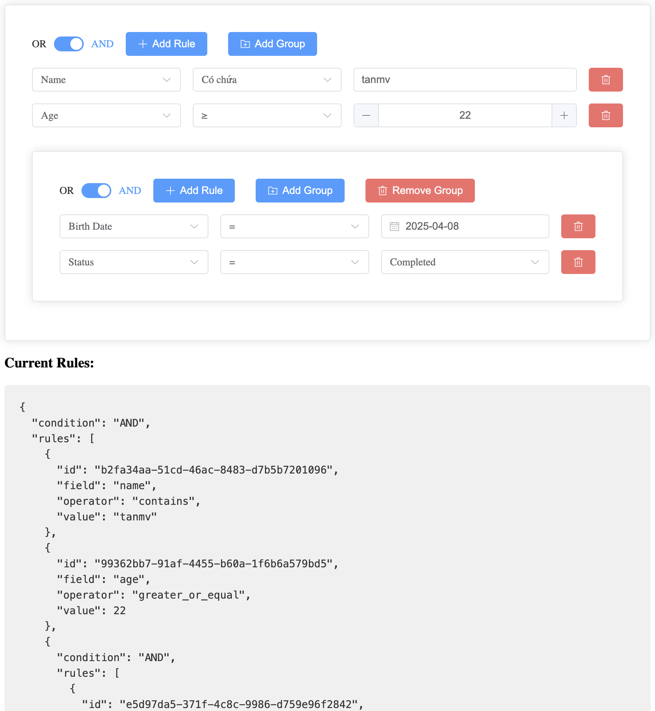

# Vue 3 QueryBuilder

A powerful and flexible query builder component for Vue 3 with Element Plus.

## Installation

```bash
npm install @mvtcode/vue3-querybuilder
```

## Repository

```bash
git clone git@github.com:mvtcode/vue3-querybuilder.git
```

## Usage

```vue
<template>
  <QueryBuilder v-model="query" :filters="filters" @update:modelValue="onQueryChange" />
</template>

<script setup lang="ts">
import { ref } from 'vue'
import { QueryBuilder } from '@mvtcode/vue3-querybuilder'
import type { QueryBuilderRule, QueryBuilderGroup } from '@mvtcode/vue3-querybuilder'
import { FilterType, Operator } from '@mvtcode/vue3-querybuilder'

const query = ref<QueryBuilderRule | QueryBuilderGroup>({
  type: 'rule',
  field: 'name',
  operator: Operator.EQUAL,
  value: '',
})

const filters = [
  {
    field: 'name',
    label: 'Name',
    type: FilterType.STRING,
    operators: [Operator.EQUAL, Operator.NOT_EQUAL, Operator.CONTAINS, Operator.NOT_CONTAINS],
  },
  {
    field: 'age',
    label: 'Age',
    type: FilterType.NUMBER,
    operators: [Operator.EQUAL, Operator.NOT_EQUAL, Operator.GREATER, Operator.LESS],
  },
]

const onQueryChange = (newQuery: QueryBuilderRule | QueryBuilderGroup) => {
  console.log('Query changed:', newQuery)
}
</script>
```

## Enums

### FilterType

```typescript
enum FilterType {
  STRING = 'string',
  NUMBER = 'number',
  BOOLEAN = 'boolean',
  DATE = 'date',
}
```

### Operator

```typescript
enum Operator {
  EQUAL = 'equal',
  NOT_EQUAL = 'not_equal',
  CONTAINS = 'contains',
  NOT_CONTAINS = 'not_contains',
  BEGINS_WITH = 'begins_with',
  ENDS_WITH = 'ends_with',
  GREATER = 'greater',
  GREATER_OR_EQUAL = 'greater_or_equal',
  LESS = 'less',
  LESS_OR_EQUAL = 'less_or_equal',
  IN = 'in',
  NOT_IN = 'not_in',
  BETWEEN = 'between',
  NOT_BETWEEN = 'not_between',
  IS_EMPTY = 'is_empty',
  IS_NOT_EMPTY = 'is_not_empty',
}
```

## Props

| Prop       | Type                                    | Default | Description                                                                                                                                 |
| ---------- | --------------------------------------- | ------- | ------------------------------------------------------------------------------------------------------------------------------------------- |
| modelValue | `QueryBuilderRule \| QueryBuilderGroup` | -       | The current query value                                                                                                                     |
| filters    | `Filter[]`                              | `[]`    | Array of available filters                                                                                                                  |
| maxDepth   | `number`                                | `0`     | Maximum depth of nested groups. Set to 0 for unlimited depth, 1 to disable nested groups, or any positive number to limit the nesting level |
| language   | `string`                                | `'vi'`  | Language for the component UI (supports 'en' and 'vi')                                                                                      |

## Events

| Event             | Parameters                                       | Description                          |
| ----------------- | ------------------------------------------------ | ------------------------------------ |
| update:modelValue | `(value: QueryBuilderRule \| QueryBuilderGroup)` | Emitted when the query value changes |

## Types

```typescript
interface Filter {
  field: string
  label: string
  type: 'string' | 'number' | 'boolean' | 'date'
  operators: string[]
}

interface QueryBuilderRule {
  type: 'rule'
  field: string
  operator: string
  value: any
}

interface QueryBuilderGroup {
  type: 'group'
  condition: 'and' | 'or'
  rules: (QueryBuilderRule | QueryBuilderGroup)[]
}
```

## Filter Configuration

Each filter can be configured with the following properties:

```typescript
interface Filter {
  field: string // Field name
  label: string // Display label
  type: 'string' | 'number' | 'boolean' | 'date' // Data type
  operators: string[] // Allowed operators
  input?: string // Input type ('select', 'radio', 'date', etc.)
  values?: Array<{
    // Values for select/radio
    value: string
    text: string
  }>
  validation?: {
    // Validation rules
    format?: string // Format for date (YYYY-MM-DD)
    min?: number // Minimum value for number
    max?: number // Maximum value for number
    step?: number // Step for number
  }
}
```

## Filter Types

### 1. Text (STRING)

```typescript
{
  field: 'name',
  label: 'Name',
  type: 'string',
  operators: ['equal', 'not_equal', 'contains', 'not_contains']
}
```

### 2. Number

```typescript
{
  field: 'age',
  label: 'Age',
  type: 'number',
  operators: ['equal', 'not_equal', 'greater', 'less'],
  validation: {
    min: 0,
    max: 100
  }
}
```

### 3. Date

```typescript
{
  field: 'birthdate',
  label: 'Birth Date',
  type: 'date',
  input: 'date',
  validation: {
    format: 'YYYY-MM-DD'
  }
}
```

### 4. Boolean

```typescript
{
  field: 'active',
  label: 'Active',
  type: 'boolean',
  input: 'radio',
  values: [
    { value: '1', text: 'Yes' },
    { value: '0', text: 'No' }
  ]
}
```

### 5. Select (Dropdown)

```typescript
{
  field: 'status',
  label: 'Status',
  type: 'string',
  input: 'select',
  values: [
    { value: 'pending', text: 'Pending' },
    { value: 'completed', text: 'Completed' }
  ],
  operators: ['equal', 'not_equal', 'in', 'not_in']
}
```

## Operators

Component supports the following operators:

- `equal`: Equal (=)
- `not_equal`: Not Equal (≠)
- `contains`: Contains (⊃)
- `not_contains`: Not Contains (⊅)
- `begins_with`: Begins With
- `ends_with`: Ends With
- `greater`: Greater Than (>)
- `greater_or_equal`: Greater Than or Equal (≥)
- `less`: Less Than (<)
- `less_or_equal`: Less Than or Equal (≤)
- `in`: In List
- `not_in`: Not In List
- `between`: Between
- `not_between`: Not Between
- `is_empty`: Is Empty
- `is_not_empty`: Is Not Empty

## Query Result

The result is returned as an object with the following structure:

```typescript
{
  type: 'group',
  condition: 'and' | 'or',
  rules: [
    {
      type: 'rule',
      field: string,
      operator: string,
      value: any
    },
    // or another group
    {
      type: 'group',
      condition: 'and' | 'or',
      rules: []
    }
  ]
}
```

## Query Conversion

### To SQL

```typescript
import { toSQL } from '@mvtcode/vue3-querybuilder'

const rules = {
  type: 'group',
  condition: 'and',
  rules: [
    {
      type: 'rule',
      field: 'name',
      operator: Operator.EQUAL,
      value: 'John',
    },
    {
      type: 'rule',
      field: 'age',
      operator: Operator.GREATER_OR_EQUAL,
      value: 18,
    },
  ],
}

const sqlWhere = toSQL(rules)
// Output: name = 'John' AND age >= 18
```

### To MongoDB

```typescript
import { toMongo } from '@mvtcode/vue3-querybuilder'

const rules = {
  type: 'group',
  condition: 'and',
  rules: [
    {
      type: 'rule',
      field: 'name',
      operator: Operator.EQUAL,
      value: 'John',
    },
    {
      type: 'rule',
      field: 'age',
      operator: Operator.GREATER_OR_EQUAL,
      value: 18,
    },
  ],
}

const mongoQuery = toMongo(rules)
// Output: {
//   $and: [
//     { name: { $eq: 'John' } },
//     { age: { $gte: 18 } }
//   ]
// }
```

### From SQL

```typescript
import { fromSQL } from '@mvtcode/vue3-querybuilder'

const rules = fromSQL("name = 'John' AND age >= 18")
// Output: {
//   type: 'group',
//   condition: 'and',
//   rules: [
//     {
//       type: 'rule',
//       field: 'name',
//       operator: Operator.EQUAL,
//       value: 'John'
//     },
//     {
//       type: 'rule',
//       field: 'age',
//       operator: Operator.GREATER_OR_EQUAL,
//       value: 18
//     }
//   ]
// }
```

### From MongoDB

```typescript
import { fromMongo } from '@mvtcode/vue3-querybuilder'

const rules = fromMongo({
  $and: [{ name: { $eq: 'John' } }, { age: { $gte: 18 } }],
})
// Output: {
//   type: 'group',
//   condition: 'and',
//   rules: [
//     {
//       type: 'rule',
//       field: 'name',
//       operator: Operator.EQUAL,
//       value: 'John'
//     },
//     {
//       type: 'rule',
//       field: 'age',
//       operator: Operator.GREATER_OR_EQUAL,
//       value: 18
//     }
//   ]
// }
```

### Supported Operators Mapping

| QueryBuilder Operator | SQL Operator | MongoDB Operator |
| --------------------- | ------------ | ---------------- |
| EQUAL                 | =            | $eq              |
| NOT_EQUAL             | !=           | $ne              |
| CONTAINS              | LIKE         | $regex           |
| NOT_CONTAINS          | NOT LIKE     | $not             |
| BEGINS_WITH           | LIKE         | $regex           |
| ENDS_WITH             | LIKE         | $regex           |
| GREATER               | >            | $gt              |
| GREATER_OR_EQUAL      | >=           | $gte             |
| LESS                  | <            | $lt              |
| LESS_OR_EQUAL         | <=           | $lte             |
| IN                    | IN           | $in              |
| NOT_IN                | NOT IN       | $nin             |
| BETWEEN               | BETWEEN      | $and             |
| NOT_BETWEEN           | NOT BETWEEN  | $nor             |
| IS_EMPTY              | IS NULL      | $exists: false   |
| IS_NOT_EMPTY          | IS NOT NULL  | $exists: true    |

## Slots

Component provides dynamic slots for each field to customize the value input:

```vue
<template>
  <QueryBuilder v-model="query" :filters="filters">
    <!-- Custom input for name field -->
    <template #name="{ operator, modelValue }">
      <el-input v-model="modelValue" placeholder="Enter name" />
    </template>

    <!-- Custom input for age field -->
    <template #age="{ operator, modelValue, isBetween }">
      <template v-if="isBetween">
        <div class="between-inputs">
          <el-input-number v-model="modelValue[0]" :min="0" :max="100" placeholder="From" />
          <el-input-number v-model="modelValue[1]" :min="0" :max="100" placeholder="To" />
        </div>
      </template>
      <template v-else>
        <el-input-number v-model="modelValue" :min="0" :max="100" />
      </template>
    </template>

    <!-- Custom input for birthdate field -->
    <template #birthdate="{ operator, modelValue, isBetween }">
      <template v-if="isBetween">
        <div class="between-inputs">
          <el-date-picker
            v-model="modelValue[0]"
            type="date"
            placeholder="From date"
            format="YYYY-MM-DD"
          />
          <el-date-picker
            v-model="modelValue[1]"
            type="date"
            placeholder="To date"
            format="YYYY-MM-DD"
          />
        </div>
      </template>
      <template v-else>
        <el-date-picker
          v-model="modelValue"
          type="date"
          placeholder="Select date"
          format="YYYY-MM-DD"
        />
      </template>
    </template>

    <!-- Custom input for status field -->
    <template #status="{ operator, modelValue }">
      <el-select v-model="modelValue" placeholder="Select status">
        <el-option label="Pending" value="pending" />
        <el-option label="Completed" value="completed" />
      </el-select>
    </template>
  </QueryBuilder>
</template>

<style>
.between-inputs {
  display: flex;
  gap: 1rem;
}
</style>
```

### Slot Props

| Name       | Type      | Description                                    |
| ---------- | --------- | ---------------------------------------------- |
| operator   | `string`  | Current operator of the rule                   |
| modelValue | `any`     | Current value of the rule                      |
| isBetween  | `boolean` | Whether the operator is BETWEEN or NOT_BETWEEN |

### Dynamic Slots

The component automatically generates slots based on the field names in your filters configuration. For example, if you have a filter with `field: 'name'`, you can use `#name` slot to customize its input.

Each slot receives the same props:

- `operator`: Current operator selected for the rule
- `modelValue`: Current value of the rule (supports v-model)
- `isBetween`: Boolean flag indicating if the operator is BETWEEN or NOT_BETWEEN

When `isBetween` is true, the `modelValue` will be an array with two elements for the range values.

## Development

```sh
# Install dependencies
npm install

# Run development server
npm run dev

# Build for production
npm run build

# Run unit tests
npm run test:unit

# Lint and fix files
npm run lint
```

## License

MIT

## Screenshot



## Author

Mạc Tân (Tanmv)

Email: [tanmv@mpos.vn](mailto:tanmv@mpos.vn)

FB: [Mạc Tân](https://facebook.com/mvt.hp.star)

Telegram: [@tanmac](https://t.me/tanmac)

Skype: [trai_12a1](skype:trai_12a1?chat)

## Examples

### Basic Usage with Max Depth

```vue
<template>
  <QueryBuilder
    v-model="query"
    :filters="filters"
    :max-depth="2"  <!-- Limit nesting to 2 levels -->
    @update:modelValue="onQueryChange"
  />
</template>

<script setup lang="ts">
import { ref } from 'vue'
import { QueryBuilder } from '@mvtcode/vue3-querybuilder'
import type { QueryBuilderRule, QueryBuilderGroup } from '@mvtcode/vue3-querybuilder'
import { FilterType, Operator } from '@mvtcode/vue3-querybuilder'

const query = ref<QueryBuilderRule | QueryBuilderGroup>({
  type: 'group',
  condition: 'AND',
  rules: []
})

const filters = [
  {
    field: 'name',
    label: 'Name',
    type: FilterType.STRING,
    operators: [Operator.EQUAL, Operator.NOT_EQUAL, Operator.CONTAINS, Operator.NOT_CONTAINS],
  },
  {
    field: 'age',
    label: 'Age',
    type: FilterType.NUMBER,
    operators: [Operator.EQUAL, Operator.NOT_EQUAL, Operator.GREATER, Operator.LESS],
  },
]

const onQueryChange = (newQuery: QueryBuilderRule | QueryBuilderGroup) => {
  console.log('Query changed:', newQuery)
}
</script>
```

### Max Depth Options

- `maxDepth={0}`: Unlimited nesting (default)
- `maxDepth={1}`: Disable nested groups completely
- `maxDepth={n}`: Limit nesting to n levels (where n is a positive number)
